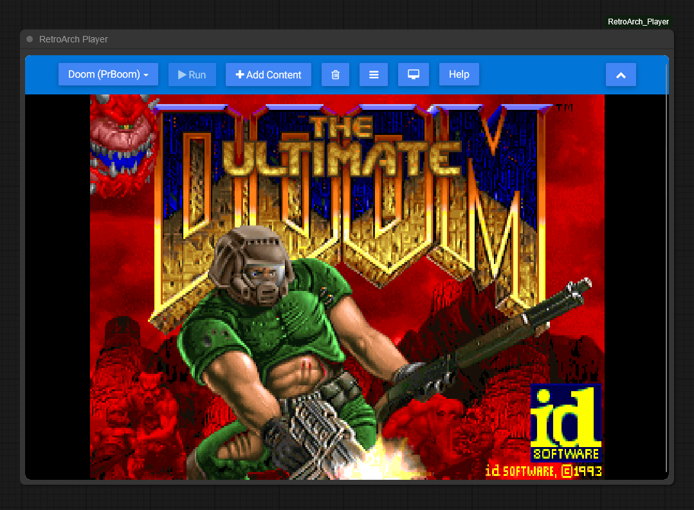

# ComfyUI RetroArch Player

Embeds the RetroArch Web Player inside a ComfyUI node.

This project uses the hosted RetroArch web player:
- https://web.libretro.com/

## Install

- **Option A (git clone)**
  - Clone this repo into:
    - `ComfyUI/custom_nodes/ComfyUI_RetroArch_Player`

- **Option B (Manager)**
  - Open Manager and install **ComfyUI_RetroArch_Player**

- **Option C (zip)**
  - Download the repo as a zip.
  - Extract it to:
    - `ComfyUI/custom_nodes/ComfyUI_RetroArch_Player`

Restart ComfyUI after installing.

## Usage

- **Add the node**
  - In ComfyUI, add the node:
    - `ComfyRetroArchPlayer` (RetroArch Player)

- **Use RetroArch**
  - The player UI is embedded inside the node.
  - Use the RetroArch menu to select a core and load content.
  - Supports many systems including NES, SNES, Genesis, PlayStation, and more.

## Notes

- **Hosted web app**
  - This embed loads `https://web.libretro.com/` in an iframe, so it requires internet access.

- **Fullscreen limitations**
  - Due to cross-origin restrictions, the fullscreen button in RetroArch may not work within the iframe.

## Troubleshooting

- **The player UI doesn't update after changes**
  - Do a hard refresh in your browser:
    - `Ctrl+F5`
  - Or clear browser cache for the ComfyUI site.

- **Node appears but iframe is missing/blank**
  - Open DevTools Console and look for errors.
  - Confirm that `https://web.libretro.com/` is reachable from your browser.

- **Iframe seems misaligned during zoom/pan**
  - Make sure you're running the latest `web/comfy_retroarch_player.js` from this repo.
  - If you have multiple copies installed, remove old versions from other `custom_nodes` folders.

- **I uploaded a rom with "Add Content" but it doesn't show up**
  - Now that you've uploaded a ROM, click "Load Content" and and click "Start Directory" to see uploaded ROMs to select.
  - Select the ROM file and it will list compatible cores to select.
  - Select the core and the game should launch.

## Credits / License

- RetroArch Web Player: [web.libretro.com](https://web.libretro.com/) by the libretro team
- This extension embeds the hosted RetroArch web player via iframe.
